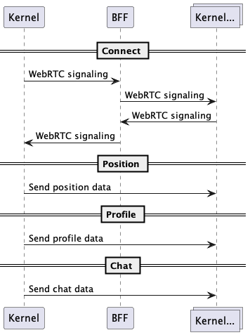

# Table of Contents

1.  [Overview](#org1e8201f)
2.  [Handshake](#org6042193)
3.  [Global messages: message bus](#org23e5083)
4.  [Livekit Transport](#org911ed6a)
5.  [WS Transport](#orge4a9f89)
6.  [Peer to peer](#org49e52f9)
7.  [Next steps: Scale with multiple nodes](#orge309bcb)
8.  [Next steps: Third party servers](#orgf76f601)
    1.  [Scene messages](#org591a951)
    2.  [Livekit](#org2262542)
    3.  [WS](#org8b067f0)
9.  [TBD](#org203c224)
10. [NAT's Messages](#orgcae79bd)

# Overview

The idea of this new version of comms is to leverage the concept of island as a unit, be able to define specific settings per island, and by doing so be able to deploy some high quality services when needed, while keep using cheaper alternatives otherwise. We call each alternative a **transport**.

We will support three types of transports for starters:

-   Livekit: webrtc, high quality but perhaps an expensive alternative.
-   WebSocket: cheaper, simpler to implement and extend.
-   Peer to peer: (using webrtc)  not very efficient but no infrastructure costs.

With regards to DCL platform alone (that is, without third party servers), users mostly need to receive information from peers in the same island, so the transports will be in charge of broadcast information between peers in a given island. For global messages (for example, scene messages), we will use the BFF.

# Handshake

-   The BFF acts as the entrypoint to the comms services. Users authenticate against this service using their address.
-   Archipelago receives (thought the BFF) a heartbeat with the current peer position and sends `change_island` messages. This message will notify kernel the user has to join or change to an specific island, the message will contain a connection string that the kernel will use to connect to one of the transports defined above. This way archipelago is in charge of telling kernel which transport will be used.
-   The BFF and Archipelago are connected as part of a [NATS](https://nats.io/) cluster, sending and receiving peer events.

# Global messages: message bus

For global messages (that is, messages across an island, for example, scene messages) we will rely on the BFF itself, in the future this could be moved to it's own projcet, the point is, this is not part of the transport's duties.

# Livekit Transport

[Livekit](https://livekit.io/) is a high quality media server using webtc, it may be expensive to deploy (specially for a large number of peers) but it's very efficient and very easy to deploy. Livekit has tools for webrtc signaling, the concepts of rooms (which we will adopt as islands) and it's own authentication. It also has it's own TURN server, so each livekit deployment will have a near by TURN server, which should minimize the cost of relay for people that cannot connect directly to the server.

# WS Transport

A simple WS sockets that classifies peers into rooms (islands) and broadcast messages inside the room. It uses JWT authentication with a shared secret (generated in Archipelago).

# Peer to peer

# Next steps: Scale with multiple nodes

Archipelago should be able to register tranport nodes and to be able to balance islands not only in the available transports but also according to a set of owner defined rules, in order to, for example, use livekit for a island in the casino and p2p in a plaza.

# Next steps: Third party servers

Owners may want to connect third party servers to their scenes, as game servers or state servers. Those servers may want to receive or publish information to/from users in a given island or globally to all the people in a scene. 

Our current idea is to have connect BFF (for messages across scenes) and transports to the NATS cluster, and then expose a service that will sit between NATS and third party service to be able to subscribe and publish messages to the cluster.

## Scene messages

## Livekit

## WS

# TBD

-   How/where do we deploy livekit?
-   Third Party Servers on P2P Transport

# NAT's Messages

-   `peer.<id>.hearbeat`
-   `peer.<id>.island_changed`

